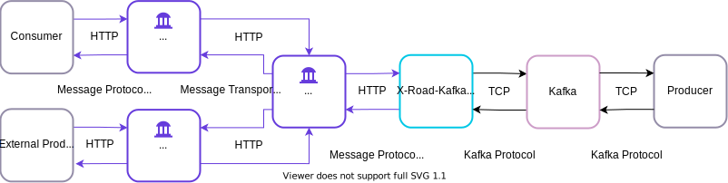
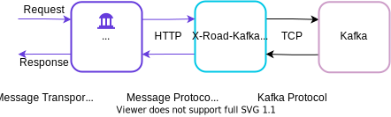
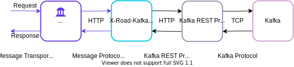

# X-Road-Kafka Adapter

[](https://jointxroad.slack.com/)
[](https://x-road.global/community)

X-Road-Kafka Adapter is an adapter component that enables connecting Apache Kafka topics to X-Road. The Adapter 
supports both producing and consuming data over a simple REST API. The producers publish data to a topic and the consumers
poll the topic and pull data from it. The Adapter sits between the Security Server and Apache Kafka, and converts 
messages between the X-Road message protocol for REST and Kafka protocol. 



In practice, both producers and consumers may use Kafka's native API directly or alternatively, they can use a REST API 
provided by the Adapter over X-Road. In real life, producers and consumers owned by the organisation who's running Kafka 
would probably use the native API whereas external producers and consumers would connect to Kafka through X-Road. 
However, all the Kafka management and maintenance operations must be done using the native API since the Adapter only 
supports a limited subset of operations for producing and consuming messages.

The Adapter implements a simple [REST API](src/main/resources/public/openapi-definition.yaml) that provides access to 
Kafka over HTTP. Currently, the API consists of the endpoints listed below. However, some additional endpoints are needed,
e.g., to manage offsets and positions. In addition to the API endpoints, the API description is available at
`http://<ADAPTER_HOST>:8080/openapi-definition.yaml`.


```
/{topicName}/subscriptions:
  post:
    summary: subscribe to a topic
  delete:
    summary: unsubscribe from a topic
/{topicName}/records:
  get:
    summary: fetch data from a topic
  post:
    summary: publish data to a topic
```

The Adapter communicates with Kafka using Kafka's binary TCP protocol. In other words, the Adapter acts as a Kafka client
and converts incoming REST API requests to Kafka binary requests, and outgoing responses from Kafka responses to HTTP
responses.



Alternatively, the Adapter can communicate with Kafka through an additional REST proxy component 
([Confluent REST Proxy](https://github.com/confluentinc/kafka-rest)) that sits between the Adapter and Kafka. 



The Adapter supports both communication methods with Kafka. Regardless of the communication method, the REST API 
provided by the Adapter is the same. The communication method can me selected in the Adapter's configuration.

## About the Implementation

Here's some considerations regarding the Adapter and its current implementation:

- Since all messages are sent using the X-Road Message Protocol for REST, the approach provides all the same security
guarantees that regular X-Road messages provide.
  - Organization-level authentication, machine-level authentication, transport-level encryption, digital signature of 
  messages, eIDAS compliant eSeals with signatures and time-stamps.
- Since the X-Road Message Protocol for REST is used, data streaming is not supported.
- Currently, the Adapter doesn't support committing offsets. Therefore, it's assumed that Kafka consumers are 
  configured to use an automatic commit policy, which triggers a commit on a periodic interval.
- The Adapter expects that incoming requests include the `X-Road-Client` HTTP header that specifies the client subsystem. 
  Since the request comes from the Security Server, the content of the `X-Road-Client` header can be trusted. The client
  identifier is used in Kafka consumer group name and consumer instance name.
- In X-Road, Kafka topics are mapped to service codes. However, a single topic may be published using several different 
service codes. The service code isn't directly linked to the topic name - there's no need to use the topic name as the
service code. The topic that is linked to a service code is defined in the service base path.
- Kafka topics can be published as `REST` or `OPENAPI3` services on the Security Server.
  - When a new `OPENAPI3` service is added, the OpenAPI description URL is 
  `http://<ADAPTER_HOST>:8080/api/v1/<topicName>/openapi-definition.yaml`.
  - Kafka topic name is included in the service base path and not in the endpoint path to enable easier access rights
  management. For example: 
    - Base path: `http://<ADAPTER_HOST>:8080/api/v1/<topicName>`
    - Endpoints: `/subscriptions`, `/records`
- Access rights to topics are managed using X-Road's access control mechanism: access is granted to subsystems on service 
code and/or endpoint level. Service code level access rights enable both producing and consuming data. Instead, endpoint 
level access control enables restricting access based on the client's role (producer/consumer).
- A single subsystem may subscribe to multiple topics and a single topic may have multiple subscribers. When a subsystem
subscribes to multiple topics, it must read data from each topic separately.
- When a subsystem subscribes to a topic, a new subsystem and topic specific Kafka consumer group is created 
automatically. This means that if the client subsystem is registered on multiple Security Servers and/or used by several 
client information systems, all the client information systems share the same Kafka consumer group and consumer instance.
- Kafka is considered as any other information system connected to X-Road. Installing, configuring and operating Kafka 
and/or Kafka cluster is out of the Adapter's scope. Also, Kafka management operations, e.g., creating new topics, is out
of the Adapter's scope. The Adapter can be used to connect any existing or new Kafka instance/cluster to X-Road.
- The Adapter is stateful which means that requests coming from the same client must always be processed by the same
Adapter instance. 

## Software Requirements

Building the application requires:

* Java 8
* Maven 3

Running the application requires Java 8 or Docker.

## Build and Run

Build the application running the below command in the project's root directory:

```
mvn clean install
```

The build produces `xrd-kafka-adapter-x.x.x-SNAPSHOT.jar` (x.x.x being replaced by the actual version) in the `target` directory.

Run the application using the command `java -jar xrd-kafka-adapter-x.x.x-SNAPSHOT.jar`. The Kafka REST proxy URL can be defined using the `-Dapp.kafka.rest-proxy-url=<PROXY_URL>` property.

## Using Docker

You can create a Docker image to run the application inside a container, using the provided `Dockerfile`. Before building the image, build the jar file:

```
mvn clean install
```

If you have not built the jar, building the Docker image will fail with message:

```
Step 2 : ADD target/xrd-kafka-adapter-*.jar xrd-kafka-adapter.jar
No source files were specified
```

While you are in the project root directory, build the image using the Docker `build` command. The `-t` parameter gives your image a tag, so you can run it more easily later. Don’t forget the `.` parameter, which tells the Docker `build` command to look in the current directory for a file called `Dockerfile`.

```
docker build -t xrd-kafka-adapter .
```

After building the image, you can run the application.

```
docker run -p 8080:8080 xrd-kafka-adapter
```

The Kafka REST proxy URL can be defined using the `app.kafka.rest-proxy-url=<PROXY_URL>` property.

```
docker run -p 8080:8080 -e "JAVA_OPTS=-Dapp.kafka.rest-proxy-url=http://rest-proxy:8082" xrd-kafka-adapter
```

The Kafka broker address can be defined using the `app.kafka.broker-address=<BROKER_ADDRESS>` property.

```
docker run -p 8080:8080 -e "JAVA_OPTS=-Dapp.kafka.broker-address=broker:8092" xrd-kafka-adapter
```

The communication method with Kafka (REST Proxy or Kafka TCP client) can be defined using the 
`app.kafka.client-qualifier=<CLIENT_QUALIFIER>` property. Supported values for the `client-qualifier` are
`restProxyClient` and `tcpClient`. If the property hasn't been defined, `restProxyClient` is used by default.

```
docker run -p 8080:8080 -e "JAVA_OPTS=-Dapp.kafka.broker-address=broker:8092 -Dapp.kafka.client-qualifier=tcpClient" xrd-kafka-adapter
```

After building the Docker image, it's also possible to run the Docker Compose example available [here](docker-compose/README.md).
